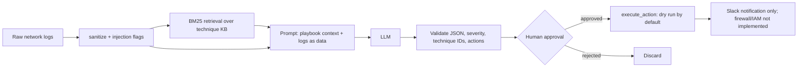

# Architecture

## Threat model (short)
| Risk | What the code does | Where |
|---|---|---|
| Prompt injection in logs | Logs are wrapped in `<logs>` tags, the system prompt says to treat them as data, delimiter tags inside logs are removed, and heuristic patterns raise a flag | `guard.py`, `triage.py` |
| Model invents technique IDs | IDs not in the knowledge base are moved to `unverified_mitre_ids` | `triage.py` |
| Model proposes harmful actions | Allowlist of action types, strict target checks (IP, hostname, username), protected-target list, re-validation at execution | `actions.py` |
| Acting without a person | `/actions/execute` refuses unless `approved` is true; `DRY_RUN` is on unless set to `false` | `api.py` |
| Oversized or malformed input | Length caps, control characters stripped, model output must parse as JSON with a valid severity | `guard.py`, `triage.py` |

The injection heuristics are a tripwire, not a wall. Determined attackers can phrase instructions the patterns miss, which is why the real protection is output validation plus human approval.

## Known gaps
- Retrieval is BM25 keyword search, not embeddings.
- The knowledge base is 20 curated techniques, not the full ATT&CK matrix.
- Only Slack notifications are implemented. Blocking IPs, disabling accounts and isolating hosts are validated and logged but not connected to any real system.
- The API layer (`api.py`) and live model calls have not been run by the author in a full environment yet.
